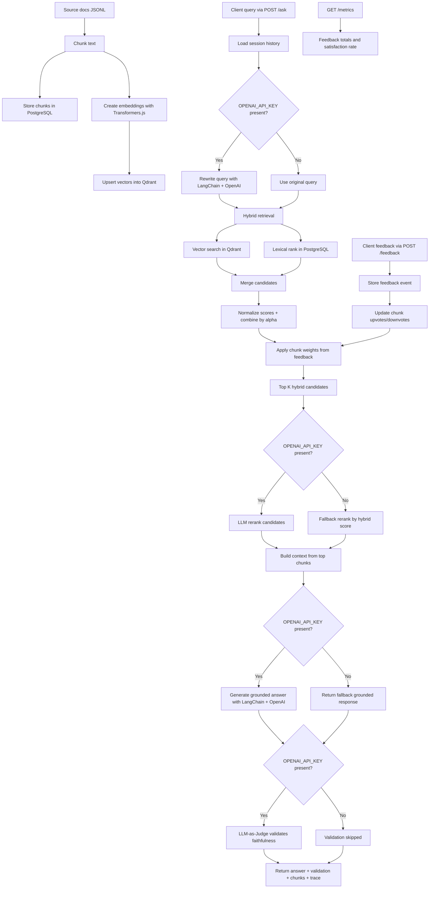

# AI Knowledge Assistant Node Version

Node.js implementation of the same retrieval system with:

- Express API
- Transformers.js embeddings
- Qdrant vector similarity search
- Hybrid retrieval (vector + lexical PostgreSQL rank)
- LangChain orchestration (query rewrite + answer generation)
- LLM-based reranking via LangChain
- LLM-as-Judge answer validation (faithfulness scoring)
- PostgreSQL feedback loop and metrics
- Streamlit UI kept separate, calling this Node API

## Structure

ai-knowledge-assistant-node/
- data/
- scripts/
- src/config
- src/data
- src/db
- src/embeddings
- src/retrieval
- src/reranker
- src/orchestration
- src/feedback
- src/routes
- src/server.js

## Prerequisites

- Node.js 20+
- PostgreSQL
- Qdrant running locally or remote

## 1) Setup

1. Install dependencies

npm install

2. Create env file

cp .env.example .env

3. Update .env values

- POSTGRES_URL must point to your database
- QDRANT_URL must point to your Qdrant instance
- OPENAI_API_KEY is optional but recommended

## 2) Index data

npm run index

This loads docs from data/sample_docs.jsonl, chunks them, stores chunks in PostgreSQL, and upserts vectors into Qdrant.

## 3) Run API

npm run dev

Server URL:

http://localhost:3000

## Endpoints

- GET /health
- POST /ask
- POST /feedback
- GET /metrics

Ask payload:

{
  "query": "How does reranking improve retrieval quality?",
  "session_id": "demo-session-1",
  "top_k": 5
}

Ask response includes:

{
  "session_id": "...",
  "answer": "...",
  "query_rewrite": "...",
  "chunks": [...],
  "validation": {
    "faithfulness": 0.92,
    "issues": [],
    "verdict": "pass"
  },
  "trace": {
    "retrieved_count": 5,
    "reranked_count": 5,
    "history_turns": 1
  }
}

Validation verdicts: pass (faithfulness >= 0.8), partial (0.5-0.8), fail (< 0.5), skipped (no API key), error (LLM failure).

## Streamlit client (separate)

The existing Streamlit app in the Python folder can call this API. Ensure its API base URL is set to:

http://127.0.0.1:3000

Then run Streamlit from the Python project as before.

## Notes

- If OPENAI_API_KEY is missing, answer generation, reranking, and validation use fallback behavior.
- Validation returns verdict "skipped" when no API key is set.
- Transformers.js runs embedding locally and can be slower on first startup due to model download.
- For larger datasets, batch upserts and asynchronous embedding workers should be added.

## What problem this system is solving

This project solves a common RAG reliability problem: pure vector search can miss exact term matches, while pure keyword search can miss semantic intent. The system combines both, reranks results with an LLM, and uses user feedback to gradually improve which chunks are favored.

At a high level, it tries to deliver:

- More relevant retrieval from mixed search signals (semantic + lexical)
- Better final context ordering before answer generation
- Grounded answers with traceable evidence chunks
- LLM-as-Judge validation to detect hallucinations before returning answers
- A feedback loop that adjusts retrieval quality over time

## Flow diagram

